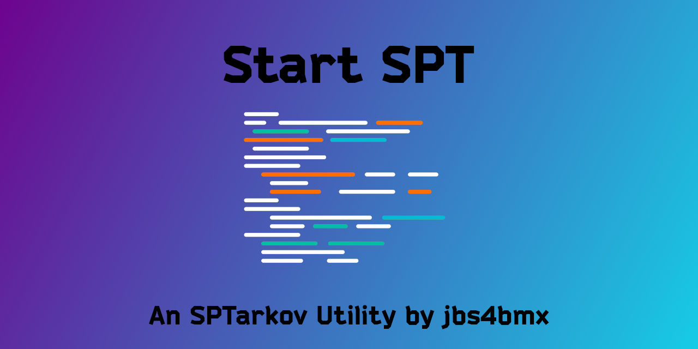
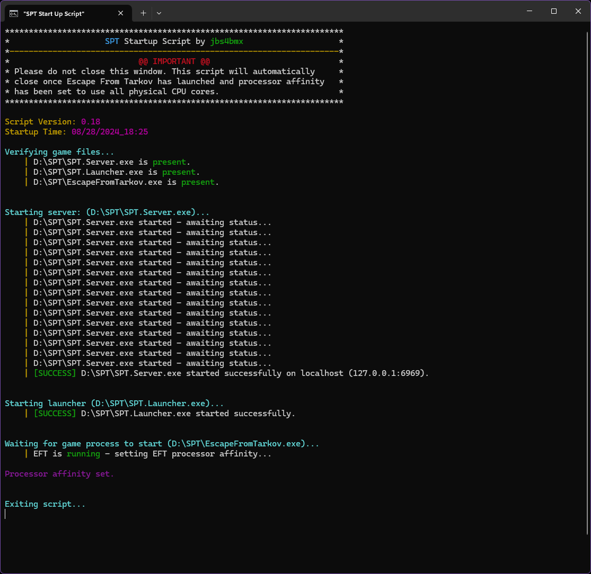

<a id="readme-top"></a>
[![Contributors][contributors-shield]][contributors-url]
[![Forks][forks-shield]][forks-url]
[![Stargazers][stars-shield]][stars-url]
[![Issues][issues-shield]][issues-url]
[![MIT License][license-shield]][license-url]

<!-- PROJECT LOGO -->
<br />
<div align="center">
  <a href="https://github.com/jbs4bmx/tarkyStuffs/scripts/StartSPT">
    
  </a>

  <h3 align="center">StartSPT</h3>

  <p align="center">Hold on to it all.<br /></p>

  [](https://ko-fi.com/X8X611JH15)
</div>


<!-- TABLE OF CONTENTS -->
<details>
  <summary>Table of Contents</summary>
  <ol>
    <li>
      <a href="#about-the-project">About The Project</a>
      <ul>
        <li><a href="#built-with">Built With</a></li>
      </ul>
    </li>
    <li>
      <a href="#getting-started">Getting Started</a>
      <ul>
        <li><a href="#prerequisites">Prerequisites</a></li>
        <li><a href="#installation">Installation</a></li>
      </ul>
    </li>
    <li><a href="#configuration">Configuration</a></li>
      <ul>
        <li><a href="#mod-faq">Mod FAQ</a></li>
      </ul>
    <li><a href="#roadmap">Roadmap</a></li>
    <li><a href="#contributing">Contributing</a></li>
    <li><a href="#license">License</a></li>
    <li><a href="#acknowledgments">Acknowledgments</a></li>
  </ol>
</details>


<!-- ABOUT THE PROJECT -->
## About The Project
Type: System Utility</br>
Disclaimer: **This mod is provided _as-is_ with _no guarantee_ of support.**

Description:</br>
This is a custom startup script for SPTarkov. It is designed to aid in the automation of starting up your SPT server and launcher without having to watch over them. It does this by launching the server, detecting the current status of the server, and then once the server has completely loaded, it starts the launcher.

The script has a firt run check to determine if you have ran it before. If not, it will create a START Menu shortcut so you can pin it to your START Menu for quicker access. Once that has been completed, then all you do to launch it is select the shortcut in your START Menu.</br>
SPECIAL NOTE: This part of the script requires administrative elevation to function... when prompted, select "Yes" or enter in your administrative credentials to continue.

You can also enable processor affinity assignment meaning that the script will wait until you launch EscapeFromTarkov.exe and once it detects that the app is running, the script will then assign processor affinity to the current runing EFT process.

**NOTE:** PECore support is currently experimental and not guaranteed to work as expected.

Example Image:</br>


<p align="right">(<a href="#readme-top">back to top</a>)</p>


### Built With
| Frameworks/Libraries                                      | Name         | Link                                       |
| :-------------------------------------------------------: | :----------: | :----------------------------------------: |
|  | `PowerShell` | [PowerShell Documentation][PowerShell-url] |
|            | `Batch`      | [Batch Documentation][Batch-url]           |

|                         IDEs                                |      Name       | Link                                      |
| :---------------------------------------------------------: | :-------------: | :---------------------------------------: |
|      | `VSCodium`      | [VSCodium Website][Vscodium-url]          |

<p align="right">(<a href="#readme-top">back to top</a>)</p>


<!-- GETTING STARTED -->
## Getting Started
This section will explain how to install and use this mod.

### Prerequisites
EFT and SPT are required to use this mod.

### Installation
_For the purpose of these directions, "[SPT]" represents your SPT folder path._

Start by downloading the mod from the [Releases](https://github.com/jbs4bmx/SpecialSlots/releases) page.

Follow these steps to install and configure the mod:</br>
  * Extract the contents of the zip file into the root of your [SPT] folder.
     - That's the same location as "SPT.Server.exe" and "SPT.Launcher.exe".

If you have never ran this script before or if you have ran it before but there is no Start Menu shortcut for it:</br>
  1. Double-click on StartSPT.bat and wait until it fully loads.
     - If this is the first time you've ran this script and there isn't a shortcut for it, then one will now be created.
     - You'll be prompted for Administrative privileges due to it needing to write to C:\ProgramData\Microsoft\Windows\StartMenu

If you have ran this script before and there is already a shortcut present:</br>
  1. Click on the shortcut titled "SPT" found in your Start Menu.
  2. Wait until you see the launcher popup.
  3. Now you can launch the game.

<p align="right">(<a href="#readme-top">back to top</a>)</p>


<!-- CONFIGURATION EXAMPLES -->
## Configuration
Edit '.\StartSPTConfig.json' file as desired. <br>
```json
{
    "CPU_AGNOSTIC_SETTINGS": "Enable or disable CPU affinity here.",
    "MultiThreadedCPU": true,
    "SetCPUAffinity": true,

    "INTEL_PE-CORE_SETTINGS": "Set your processor settings here if you run an Intel PE Core processor.",
    "IntelPECoreCPU": false,
    "IntelPCores": 2,
    "IntelECores": 2
}
```

**NOTE:** PECore support is currently experimental and not guaranteed to work as expected.</br>
For PECore CPUs, enter in the physical count of PCores, not the count of threads that they are capable of. The number of threads will be calculated based on the previous setting of "MultiThreadedCPU".

<p align="right">(<a href="#readme-top">back to top</a>)</p>

### Mod FAQ
   1. Where do I report bugs found with the current version of the mod?
      - You can report bugs for the current version of this mod here: [Issues](https://github.com/jbs4bmx/StartSPT/issues).


<!-- ROADMAP -->
## Roadmap
- [x] Add Changelog
- [ ] Verify and improve PECore support via testing and feedback.

Suggest changes or view/report issues [here](https://github.com/jbs4bmx/StartSPT/issues).

<p align="right">(<a href="#readme-top">back to top</a>)</p>


<!-- CONTRIBUTING -->
## Contributing
Contributions are what make the open source community such an amazing place to learn, inspire, and create. Any contributions you make are **greatly appreciated**.

If you have a suggestion that would make this better, please fork the repo and create a pull request. You can also simply open an issue with the tag "enhancement".
Don't forget to give the project a star! Thanks again!

1. Fork the Project
2. Create your Feature Branch (`git checkout -b feature/AmazingFeature`)
3. Commit your Changes (`git commit -m 'Add some AmazingFeature'`)
4. Push to the Branch (`git push origin feature/AmazingFeature`)
5. Open a Pull Request

You can also buy me a coffee! (This is not required, but I greatly appreciate any support provided.)</br>
[](https://ko-fi.com/X8X611JH15)

<p align="right">(<a href="#readme-top">back to top</a>)</p>


<!-- LICENSE -->
## License
Distributed under the MIT License. See `LICENSE.txt` for more information.

<p align="right">(<a href="#readme-top">back to top</a>)</p>


<!-- ACKNOWLEDGMENTS -->
## Acknowledgments
Contributors:</br>
None yet.

<p align="right">(<a href="#readme-top">back to top</a>)</p>


<!-- Repository Metrics -->
[contributors-shield]: https://img.shields.io/github/contributors/jbs4bmx/SpecialSlots.svg?style=for-the-badge
[contributors-url]: https://github.com/jbs4bmx/SpecialSlots/graphs/contributors
[forks-shield]: https://img.shields.io/github/forks/jbs4bmx/SpecialSlots.svg?style=for-the-badge
[forks-url]: https://github.com/jbs4bmx/SpecialSlots/network/members
[stars-shield]: https://img.shields.io/github/stars/jbs4bmx/SpecialSlots.svg?style=for-the-badge
[stars-url]: https://github.com/jbs4bmx/SpecialSlots/stargazers
[issues-shield]: https://img.shields.io/github/issues/jbs4bmx/SpecialSlots.svg?style=for-the-badge
[issues-url]: https://github.com/jbs4bmx/SpecialSlots/issues
[license-shield]: https://img.shields.io/github/license/jbs4bmx/SpecialSlots.svg?style=for-the-badge
[license-url]: https://github.com/jbs4bmx/SpecialSlots/blob/master/LICENSE.txt

<!-- Framwork/Library URLs -->
[PowerShell-url]: https://learn
[Batch-url]: https://learn.microsoft.com/en-us/windows-server/administration/windows-commands/windows-commands
[Vscodium-url]: https://vscodium.com/